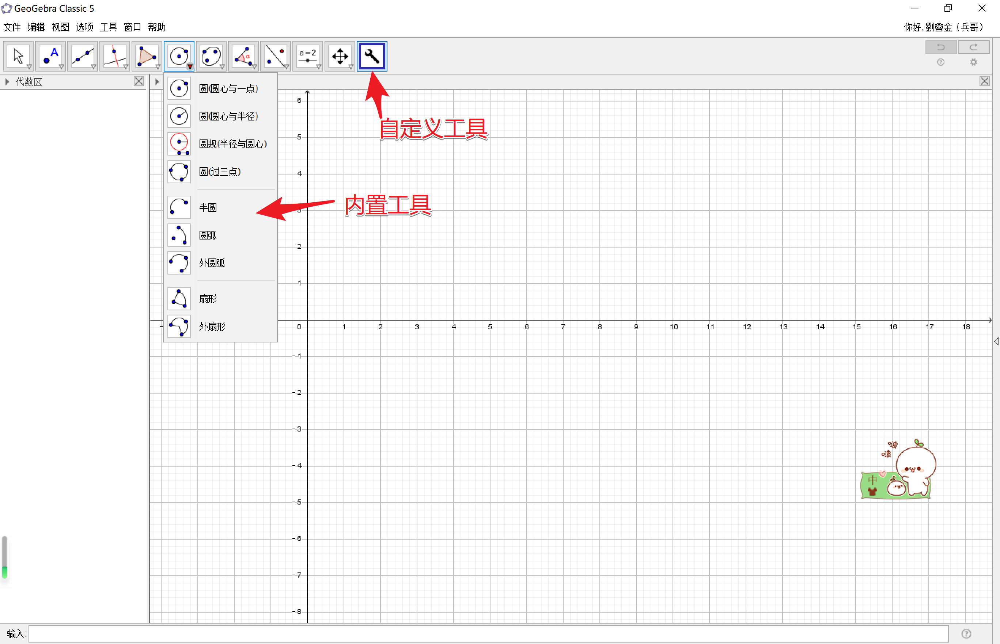

# geogebra学习感悟

geogebra这个现在流行起来的画板软件，用户范围非常广泛，全世界各地都遍布geogebra研究院，我就不介绍，软件的口号是：动态数学的教与学，适合教师、学生和有兴趣的所有人。

## geogebra的优与劣

  每学习一个工具或者软件，我希望了解他的过去、现在、未来。从这三个角度来审视和考察这个软件的未来。就我使用该软件和对软件的进一步理解，该软件值得投入时间和精力进行学生，它代表了未来画板的发展趋势，也更符合大时代潮流的教与学。有这其他画板所不具有的优势。

①开源，免费，开放共享。成百上千的人使用和参与软件的改进，并开辟了专门的分享社区，大家可以学习来自世界各地的用户的课件，共同成长提高。

②跨平台，手机，电脑，web端都可以进行使用该软件进行创作和学习

虽然跟传统的画板软件比较，geogebra现在在某些方面表现不是很突出，比如，在平面几何部分，不如几何画板那么成熟和方便，当我相信这一点随着时间的推移，会慢慢得到解决。

## 习软件的三种境界

  一、工具

  学会使用geogebra已经封装好的工具，可以直接使用，操作简便。有过几何画板和其他画板操作经验的教师容易上手，几何画板经过多少年的推广应用，已经有高人做出了很多出色的课件和自定义工具，几何画板对于初中的教学还是有着其优势。同样的，geogebra同样支持自定工具，网络教程都有，中国大学生Mooc里面有北京大学教授唐大仕开设的Mooc培训课程，也有介绍自定义工具的使用方法。所有这给了用户很大的发挥空间，充分集大家智慧，分享工具，创造工具。你我都是奉献者！

  二、指令

该软件内置了300多个基本指令，利用这些指令也可以画出数形结合的对象，比如圆，就可以用circle()指令进行画圆。其实，从指令的角度来看，工具不过是封装好的，大家使用频繁的指令集，方便大家调用而已。由这些指令大家可以充分发挥想象创造，可以创造更多优质的工具和画出所需要的对象，当然还有一些高级指令的应用需要大家注意，比如：sequence

 三、脚本

脚本更多用于创造更高级，交互式的课件，他主要有应用对象三种模式，点击时，更新时，全局，其实就是触动一些对象的运动，属性的变化，建立了对象之间的一种更强的关系，发挥创造区间广大。

